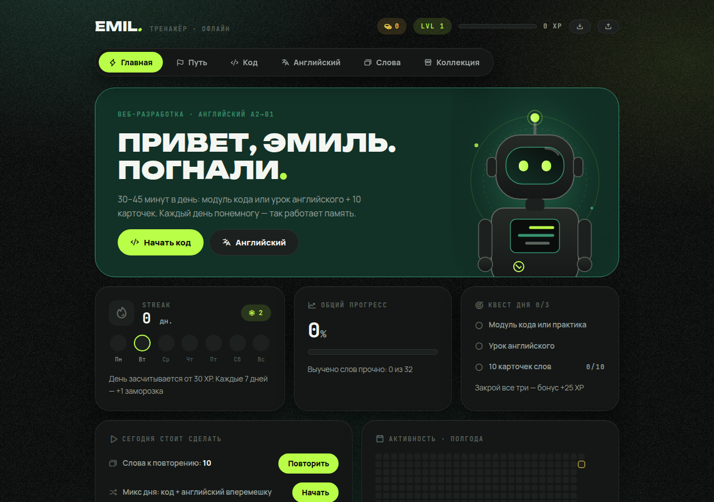

# EMIL — Тренажёр 🧠⚡

Персональный геймифицированный тренажёр для ежедневных занятий: **веб-разработка** (HTML/CSS/JS) и **английский язык A2→B1**.

**▶ Живая версия:** https://abdullinemil6901-crypto.github.io/learning-hub/

## Что внутри

- 📚 **Уроки программирования** — теория, викторины, практика с кодом и живым превью
- 🇬🇧 **Уроки английского** — грамматика, упражнения, работа над ошибками
- 🃏 **Карточки слов (SRS)** — интервальное повторение, чтобы слова запоминались прочно
- 🔥 **Стрик и XP** — день засчитывается от 30 XP, каждые 7 дней — заморозка стрика
- 🪙 **Магазин** — монеты за занятия, награды и коллекция
- 📊 **Дашборд** — тепловая карта активности за полгода, общий прогресс, ежедневные квесты

## Как это устроено

Всё приложение — один файл `index.html` без сборки и зависимостей (шрифты и иконки подгружаются с CDN). Прогресс хранится в `localStorage` браузера; в настройках есть экспорт/импорт прогресса в файл — используйте его при смене браузера или устройства.

## Запуск локально

Просто откройте `index.html` в браузере — сервер не нужен.

## Публикация (GitHub Pages)

Репозиторий готов к публикации: **Settings → Pages → Source: Deploy from a branch → Branch: `main` / root → Save**. Через минуту сайт появится по ссылке выше.
